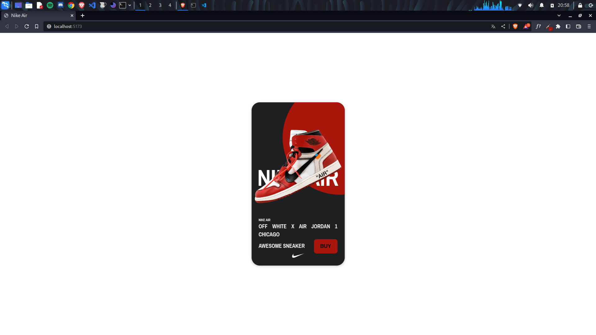

# React Card
> This project is an Card made with [React.Js](https://reactjs.org/) and [Framer Motion](https://www.framer.com/motion/)
&nbsp;
# Contents
- [React Card](#react-card)
- [Contents](#contents)
- [About](#about)
- [Installation](#installation)
- [Technologies](#technologies)
# About
### This project is a card with effect parallax build with framer.motion
&nbsp;

# Installation
### Pre-requisites

Before starting, you will need to have the following tools installed on your machine: [Git](https://git-scm.com), [Node.js](https://nodejs.org/en/) and [Npm](https://www.npmjs.com/). It's good to have an editor to work with the code like [VSCode](https://code.visualstudio.com/).

### Run this project 
#### Clone this repository
```bash
git clone https://github.com/felipecepluki/react-card.git
```
#### Now, generate node_modules folder

```bash
npm install
```

#### Now we can finally run the project
```bash
npm run dev
```

# Technologies
The following tools were used in building the project:
- [Vite](https://vitejs.dev/)
- [React](https://pt-br.reactjs.org/)
- [Styled Components](https://styled-components.com/)
